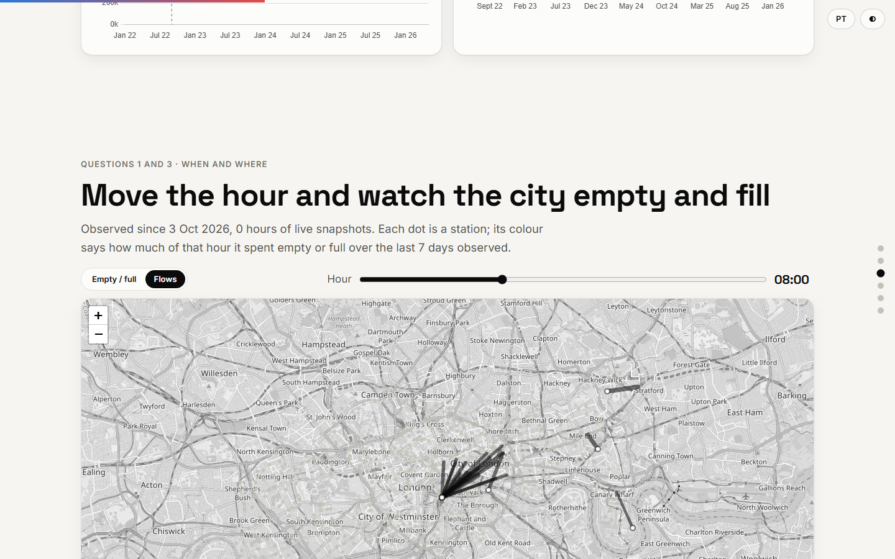

# London Cycle Hire Pipeline

**Where do London's public bikes run out, and where should operations act first?** A data pipeline on TfL Santander Cycles: live snapshots of every station every 15 minutes, 41 million published trips, PostgreSQL and dbt, and a results page rebuilt from scratch every day.

## 🔗 Access the project

[](https://diegosantiago1.github.io/london-cycle-hire-pipeline/)
[](https://diegosantiago1.github.io/Portifolio/#projetos)

**Direct link:** https://diegosantiago1.github.io/london-cycle-hire-pipeline/

An interactive page in English and Portuguese that opens in the browser, with nothing to install: a map you can move hour by hour, the stations ranked by estimated lost trips, and the pipeline's own health, live.

[Português](README.pt-BR.md) · [Plan](docs/PLAN.md) · [Decisions and measurements (D1–D43)](docs/DECISOES.md)



## The problem

London's cycle hire has a daily operational problem: **rebalancing**. In the morning, residential stations empty out and central ones fill up; in the evening it reverses. An empty station is a trip that never happens; a full one is a rider who cannot return the bike.

The pipeline answers four questions:

1. Which stations run empty or full, and at what times?
2. How long does each station spend with no bikes (or no free docks)?
3. What are the origin → destination flows, hour by hour?
4. Where should operations act first? Stations are ranked by **estimated lost demand**: hours empty × how many people usually take a bike there at that hour (and the same for full stations and returns).

The engineering challenge is that **the data never stops arriving**: incremental loads, idempotency (running twice never duplicates), untouched raw data, quality tests, freshness and scheduled runs.

## What the data shows

- **The commute is visible in the flows.** On an average weekday the busiest link at 8am is Waterloo Station 3 → Queen Street (Bank), about 3.2 trips per weekday; at 5pm the busiest is St Paul's → Waterloo Station 3. Bikes leave the rail terminal in the morning and come back in the evening.
- **E-bikes grew from 0 to 19.5% of trips** (May 2026). The first e-bike trips in the files are on 14 September 2022.
- **TfL changed its data system in September 2022**, and the files show it: two days with almost no trips (10–11 Sep 2022) and a level about 25% lower afterwards. The source does not say whether that is demand or a change in what is counted, so the page marks the line instead of comparing across it.
- **Live occupancy started on 3 October 2026.** The ranking needs a few days of snapshots to mean something and improves every day; the page says so while there are fewer than 72 hours of data.

## How it works

```
                 every 15 min (minutes 7, 22, 37, 52)
 TfL BikePoint API ──► collector (serverless-style handler, stdlib only) ──► raw, untouched (.json.gz)
                                                                          one GitHub Release per day
                 daily (GitHub Actions)
 last 28 days of snapshots ─┐
 trip aggregates (repo CSV) ├─► throwaway PostgreSQL ─► dbt build + tests ─► exporter ─► GitHub Pages
 run records ───────────────┘     (rebuilt from raw)     + source freshness   (refuses on
                                                                              missing data)
                 when TfL publishes a new trip file (on a PC)
 TfL bucket ──► download by ETag ──► incremental load ──► PostgreSQL ──► dbt ──► small aggregates (CSV in repo)
```

**Two rhythms.** GitHub Actions keeps no database between runs and could not hold 41 million trips, so the heavy, rare part (trip files, published months late) runs on a PC, and the light, daily part runs in Actions. The daily job rebuilds the database from the raw data every time, which proves in practice that the pipeline is reproducible.

| Layer | What it does |
|---|---|
| **Collector** (`src/bicicletas/coleta_api.py`) | Python standard library only, written as a serverless-style function handler (`lambda_handler(event, context)`) so it can move to a managed scheduler unchanged. Three attempts with growing waits; a response without the BikePoint shape (HTML error page, empty list, missing fields) is a failed run and never reaches the raw data. Every run writes a record (success or failure, trigger, station count, SHA-256): GitHub deletes run history after 90 days, the record stays. |
| **Raw data** | Each response stored byte for byte (gzip `mtime=0`, so the same content gives the same hash), S3-style keys (`bruto/bikepoint/data=YYYY-MM-DD/...`), never overwritten. A deterministic daily `.tar` with a hash manifest lets the daily job download 28 files instead of ~2,700. |
| **Trip files** (`viagens_download.py`, `viagens_carga.py`) | Downloaded by ETag with a receipt (size, SHA-256, publication date), into a `.parcial` file swapped in only after checking. Loaded **by column name**, never by position; an unknown column, a missing one or a row with the wrong number of fields rejects the file. One transaction per file: delete that file's rows, insert, record the version. Running twice does not duplicate; a republished file replaces the old version; a failure halfway leaves the previous version intact. |
| **dbt** (`dbt/`) | `staging` (types, two file formats unified) → `intermediario` → `marts` (occupancy by station and hour, lost demand, ranking, flows, health), 17 models with 47 data tests and source freshness (snapshots: warn after 1 h, error after 3 h). |
| **Page** (`site/`) | Exported only after `dbt build` passes; a failing test keeps yesterday's page. A late collector does not block the page: it shows the health in red. |

## Data quality: measured before deciding

| Finding | What was done |
|---|---|
| **6 header variants** in the trip files since 2022: columns in different orders, one file without `EndStation Id`, four files exported through Excel (no quotes, dates like `14/08/2024`, station `022165` written as `22165`) | Read by column name; two date formats; station numbers padded back to 6 digits (= the API's `TerminalName`) |
| **0 duplicated trips** across 148 files, even where file names overlap by a day | No de-duplication; a `unique` test guards it |
| **Relocated stations**: old sites marked with suffixes (`200025444`, `300006-1`) and names ending in `_OLD`, 139,628 trips (0.34%) | Kept as "old location", left out of station-level analysis |
| **The repeated hour** when British Summer Time ends: 3,129 trips | PostgreSQL's rule (second occurrence, GMT), flagged; durations come from the duration column |
| **3 days with almost no trips** (10–11 Sep 2022, 5 Aug 2025) | Counted per month (`dias_incompletos`) and shown on the chart |
| **The API serves a cache**: consecutive snapshots can be byte-identical; median data age at collection about 20 min | Occupancy measured at collection time; data age measured daily and shown |
| **In 625 of 799 stations, bikes + free docks ≠ docks** (docks out of service) | Empty = `NbBikes = 0`, full = `NbEmptyDocks = 0`, never derived from `NbDocks` |

## Run it

Requirements: Python 3.14, Docker (PostgreSQL 16) and Git Bash on Windows.

```bash
python -m venv .venv && .venv/Scripts/pip install -r requirements-dev.txt
cp .env.example .env                     # set your own password and data folder
python -m bicicletas.bootstrap           # user and databases in the PostgreSQL container
python -m bicicletas.migracoes principal
python -m bicicletas.viagens_download    # ~6.5 GB of trip files, outside OneDrive
python -m bicicletas.viagens_carga       # 41 million rows; run again = nothing to do
python -m bicicletas.dbt_rodar build --select tag:viagens
python -m bicicletas.agregados exportar && python -m bicicletas.agregados carregar
python -m bicicletas.retratos_carga --pasta <folder with snapshots>
python -m bicicletas.dbt_rodar build --select tag:diario
python -m bicicletas.exportar_site
pytest                                   # 197 tests; pytest -m rede also hits the real API
```

## Tests

197 automated tests plus one against the live API: hostile inputs (HTML instead of JSON, truncated gzip, an unknown CSV column, SQL injection in names, a file changed after download, a republished file, a failure halfway through a load), the shell scripts run against a fake `gh`, and an **end-to-end test** that goes raw → dbt → aggregates → daily dbt → page data and checks the numbers that come out (45 minutes empty × 2.5 pickups an hour = 1.9 lost trips). CI runs everything on every push against a real PostgreSQL; warnings are errors.

## Limitations and next steps

- **Lost demand is a conservative estimate**: past trips only happened when there was a bike, so the usual rate already understates demand where stations are often empty.
- **Occupancy has 15-minute resolution**, and the API's own cache adds about 20 minutes of lag.
- **Trip files arrive months late**: the demand profile is from the latest 12 published months, not the current week.
- **The GitHub Actions cron is late and can skip runs**; every scheduled run is measured against its slot. Next step: move the collector to a scheduler with guaranteed timing, using the same handler and the same raw-data keys.

## Data source and licence

Powered by TfL Open Data. Contains data from Transport for London, used under the TfL transport data terms (based on the Open Government Licence v2.0). Map tiles © OpenStreetMap contributors. This project is not affiliated with or endorsed by Transport for London.
